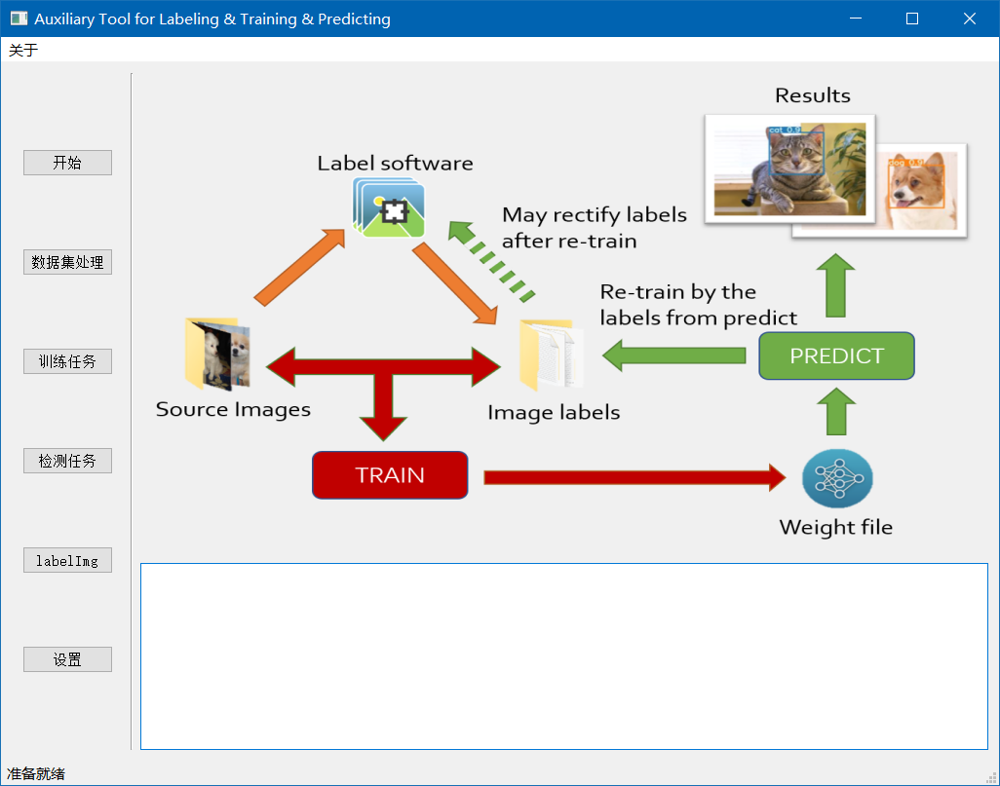

# AuxLabel Tool
[English](./README.md) | [简体中文](./README_CN.md)

This repository provides a python project which can provides an executable tool for labeling &amp; training &amp; referencing tasks based on YOLOv8.

# 💻Requirements

+ Microsoft Windows 7 / 8 / 8.1 / 10 / 11
+ An NVIDIA GPU which can support your deep learning tasks (If you don't mind running it on CPU, then it's optional)
+ Python 3.8 or higher, and many [python packages](./requirements.txt)

# 😫How to deploy it?

1. Use `git clone https://github.com/Nuaza/auxlabel_tool.git` to clone this repository to your device. (If you get an error in this step, please check your Internet)
2. Use `cd auxlabel_tool` to step into the directory
3. Use `pip install -r requirements.txt` to install every packages you may needs. (If you get an error in this step, please check your python installation)
4. Use `python auxLabel_GUI.py` to run it.

# 🤨How to run it?

# 😮What does it provide?

A convenient way to create your YOLO datasets, to label your images, to train your weights, to predict images by the weights and to re-label your images, to re-train your weights...

For example, you have a dataset with 11451 images without annotations. You may just label 50 or 100 of them by your hand, and then use them to train your weight file with 300 epochs. Then you get 11451 images with annotations (well, most of them must be inaccurate). So we back to the labeling step, you can re-label some of them to ensure the accuracy of your final weight file, and then re-train, re-predict ...

Well if you doesn't like this procedure, you can also just regard it as an auxiliary tool which can help you to process your deep learning project.

# 😉TODO

| Status | Things                                 |
| ------ | -------------------------------------- |
| ❌      | Translate the whole project to English |
| ❌      | Adapt to other YOLO versions           |

# 📑Reference

[ultralytics/YOLOv8](https://github.com/ultralytics/ultralytics)

[HumanSignal/labelImg](https://github.com/HumanSignal/labelImg)

