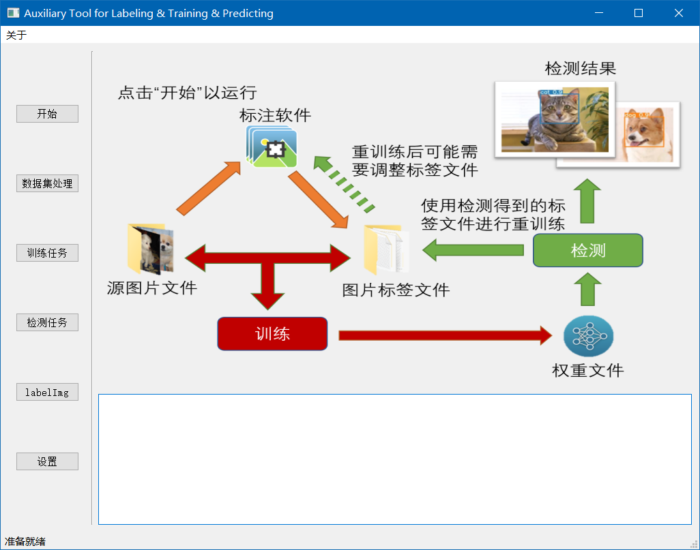

# AuxLabel Tool

[English](./README.md) | [简体中文](./README_CN.md)

这个项目基于YOLOv8，用于一键式处理数据集&进行训练任务&进行检测任务

# 参考

[ultralytics/YOLOv8](https://github.com/ultralytics/ultralytics)

[HumanSignal/labelImg](https://github.com/HumanSignal/labelImg)
